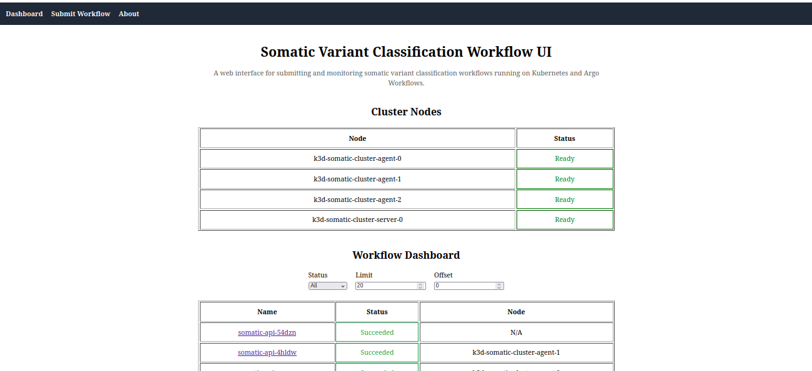
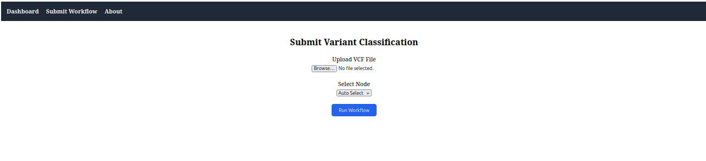

# Somatic Workflow UI

A lightweight web interface for submitting and monitoring somatic
variant classification workflows running on Kubernetes and Argo
Workflows.

------------------------------------------------------------------------

# System Overview

The UI provides a browser-based interface for:

-   Uploading VCF files
-   Submitting classification workflows
-   Monitoring workflow status
-   Viewing result summaries
-   Downloading TSV outputs

------------------------------------------------------------------------

# Directory Structure

    somatic-workflow-ui/

    src/
     ├── components/
     │    └── Navbar.jsx
     │
     ├── pages/
     │    ├── Dashboard.jsx
     │    ├── SubmitWorkflow.jsx
     │    ├── WorkflowDetails.jsx
     │    ├── WorkflowResults.jsx
     │    └── About.jsx
     │
     ├── api/
     │    └── apiClient.js
     │
     ├── App.jsx
     └── main.jsx

------------------------------------------------------------------------

# System Architecture

    User (Browser)
          │
          ▼
    React UI (Workflow Dashboard)
          │
          │ HTTP requests
          ▼
    FastAPI Service
    (somatic-workflow-api)
          │
          ▼
    Argo Workflows Server
          │
          ▼
    Kubernetes Cluster
          │
          ▼
    Workflow Pod (Classifier Container)
          │
          ▼
    Shared Storage (/refdata)
          │
          ├── input VCF files
          └── output TSV results

User input: - VCF file upload - optional node selection

System output: - workflow status - result summary (table + chart) -
downloadable TSV file

------------------------------------------------------------------------

# Prerequisite: API Environment

This UI requires the backend API from Task III to be running.

Repository: https://github.com/khan1094/somatic-workflow-api

The API service communicates with:

-   Kubernetes (k3d cluster)
-   Argo Workflows
-   Shared volume `/refdata`

Without the API running, the UI cannot function.

------------------------------------------------------------------------

# Verify API Environment

Ensure the Kubernetes cluster and API are running.

### Check cluster nodes

    kubectl get nodes

Example output:

    NAME                           STATUS
    k3d-somatic-cluster-agent-0    Ready
    k3d-somatic-cluster-agent-1    Ready
    k3d-somatic-cluster-agent-2    Ready
    k3d-somatic-cluster-server-0   Ready

### Check Argo components

    kubectl get pods -n argo

Expected entries:

    argo-server
    workflow-controller
    somatic-api

### Start API port-forward

    kubectl port-forward svc/somatic-api -n argo 8000:8000

This exposes the API locally at:

    http://localhost:8000

------------------------------------------------------------------------

# UI Installation

Requirements:

-   Node.js \>= 20
-   npm

Verify:

    node -v
    npm -v

Clone repository:

    git clone https://github.com/khan1094/somatic-workflow-ui
    cd somatic-workflow-ui

Install dependencies:

    npm install

Start development server:

    npm run dev

UI will be available at:

    http://localhost:5173

------------------------------------------------------------------------

# Using the Interface

## Dashboard

The dashboard shows:

-   cluster node status
-   workflow list
-   workflow status

Filters allow:

-   status filtering
-   limit and offset pagination

## Submit Workflow

The **Submit Workflow** page allows users to:

1.  Upload a `.vcf.gz` file
2.  Optionally select a compute node
3.  Start a workflow

After submission, the interface automatically redirects to the workflow
details page.

## Workflow Details

Displays:

-   workflow name
-   execution node
-   start / finish timestamps
-   workflow status

Actions:

-   delete workflow
-   view results
-   download TSV

## Results Page

Provides:

-   classification summary table
-   pie chart visualization
-   TSV download link

------------------------------------------------------------------------

# Workflow Status

Possible workflow states:

    Running     workflow is still executing
    Succeeded   workflow completed successfully
    Failed      workflow execution failed

Execution time depends on system load and input size.

------------------------------------------------------------------------
